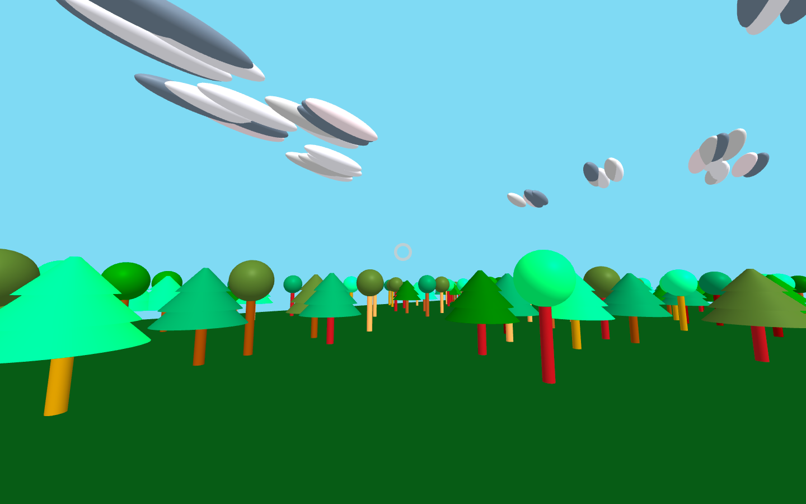

# Typical Day

<!-- Note, the line below this one is what links to your screenshot, **DO NOT REMOVE** -->

<!--
In this file, you should write a brief description of what your
project is, what you learned, and a simple screenshot of your work.

To add a screenshot, please replace `screenshot.png` with
your own screenshot.
-->

## <your-project-name>

This first version of Typical Day is made on "http://learnmyr.org" and it generates a forest filled with trees, grass, and clouds which are still currently on a developmental stage.
